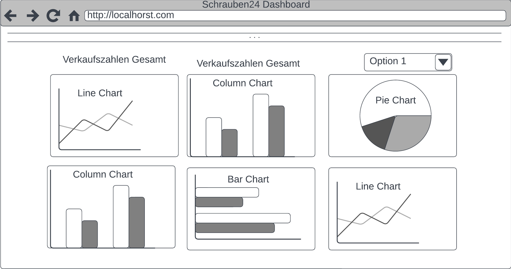
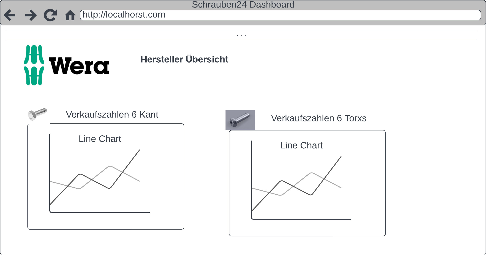

# Projekt: Verkaufsdaten-Dashboard

## Überblick

Das Ziel dieses Projekts ist die Erstellung eines interaktiven Dashboards zur Visualisierung von Verkaufsdaten für verschiedene Schraubenarten von verschiedenen Herstellern. Dabei **kann** ChartJs zur Darstellung der Daten und Bootstrap zur Gestaltung der Benutzeroberfläche verwendet werden.

Das Dashboard soll die unten aufgeführten Anforderungen erfüllen und dabei auf Benutzerfreundlichkeit und das Design der Benutzeroberfläche achten.

## Anforderungen

### Übersichts-Dashboard:

1. **Top 3 Schrauben**: Zeigt die drei Schraubenarten, die die höchsten Verkaufszahlen aufweisen.

2. **Top 3 Hersteller**: Präsentiert die drei Hersteller mit den höchsten Verkaufszahlen.

3. **Bester Verkaufstag insgesamt**: Identifiziert und zeigt den Tag mit den höchsten Gesamtverkaufszahlen an.

### Erweiterte Anforderungen:

1. **Durchschnittlich beste Verkaufstag pro Woche**: Ermittelt und visualisiert den Wochentag, an dem im Durchschnitt die besten Verkaufszahlen erzielt werden.

2. **Prozentualer Anteil der Schraubenverkäufe von Hersteller X**: Berechnet und visualisiert den prozentualen Anteil der verkauften Schrauben, die von einem bestimmten Hersteller (Hersteller X) stammen.

### Filter-Menü:

Das Dashboard sollte ein Filter-Menü enthalten, das den Benutzern ermöglicht, folgende spezifische Daten anzuzeigen:

1. **Umsatz pro Schraubenart pro Monat**: Zeigt den Umsatz für jede Schraubenart in einem ausgewählten Monat an.

2. **Umsatz pro Schraubenart pro Hersteller pro Monat**: Zeigt den Umsatz für jede Schraubenart eines bestimmten Herstellers in einem ausgewählten Monat an.

3. **Gesamtumsatz pro Hersteller für einen Monat**: Präsentiert den Gesamtumsatz eines Herstellers für einen ausgewählten Monat.

### Hersteller Einzelansicht:

Füge pro Hersteller eine Einzelansicht hinzu, die alle relevanten Analysen (Umsatz, Menge, Trends) für diesen Hersteller darstellt.

Binde das Logo des Herstellers ein und füge die passenden Diagramme hinzu. 
### Regeln

1. Erstellt **Scrum Tickets**, um die Aufgaben des Projekts zu organisieren und zu verfolgen.

2. Erstellt eine **Dokumentation** (Readme.md), die alle relevanten Informationen zum Projekt enthält, wie z.B. Installationsanleitungen, Anforderungen, Anleitungen zur Verwendung des Dashboards usw.

3. Nutzt **GitHub**, um den Code des Projekts zu verwalten und die Zusammenarbeit im Team zu erleichtern.

4. Führt täglich die **Hausaufgabe** durch, in der ihr den Fortschritt eures Projekts dokumentiert und mögliche Herausforderungen oder Erfolge besprecht.

5. Bereitet euch auf eine Demo-Präsentation des Dashboards vor einem Publikum vor, um eure Ergebnisse zu präsentieren und Feedback zu erhalten.

Viel Erfolg bei eurem Projekt!